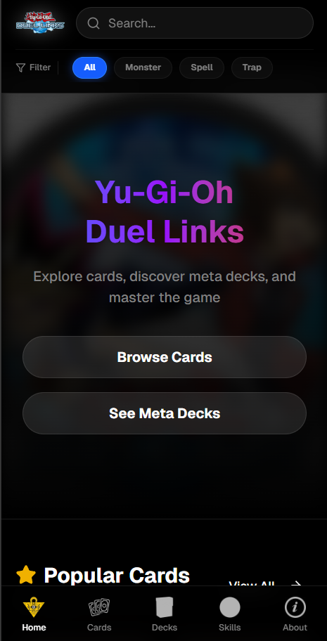

# 🃏 Yu-Gi-Oh! Duel Links Catalog (PWA)

A comprehensive Progressive Web App (PWA) catalog for Yu-Gi-Oh! Duel Links. Built with **Next.js 16**, **TypeScript**, and **Firebase**, designed to provide a seamless mobile experience with full offline capabilities.



## 🚀 Features

* **📱 Progressive Web App (PWA):** Installable on mobile/desktop and works 100% offline using Service Workers.
* **🎴 Card Catalog:** Browse detailed information for over 90+ cards, including Monsters, Spells, and Traps.
* **⚔️ Decks & Skills:** Explore meta decks and character skills with detailed descriptions.
* **🔍 Search & Filter:** Quickly find cards or skills (optimized for caching).

## 🛠️ Tech Stack

* **Framework:** [Next.js 16 (App Router)](https://nextjs.org/)
* **Language:** [TypeScript](https://www.typescriptlang.org/)
* **Styling:** [Tailwind CSS](https://tailwindcss.com/)
* **Database:** Firebase Firestore

## 📦 Getting Started

Follow these steps to run the project locally:

### 1. Clone the repository
```bash
git clone [https://github.com/username/repo-name.git](https://github.com/username/repo-name.git)
cd Duel-Links-Katalog-main
```
### 2. Install Dependencies
Navigate to the project folder and install the required packages:

```bash
npm install
